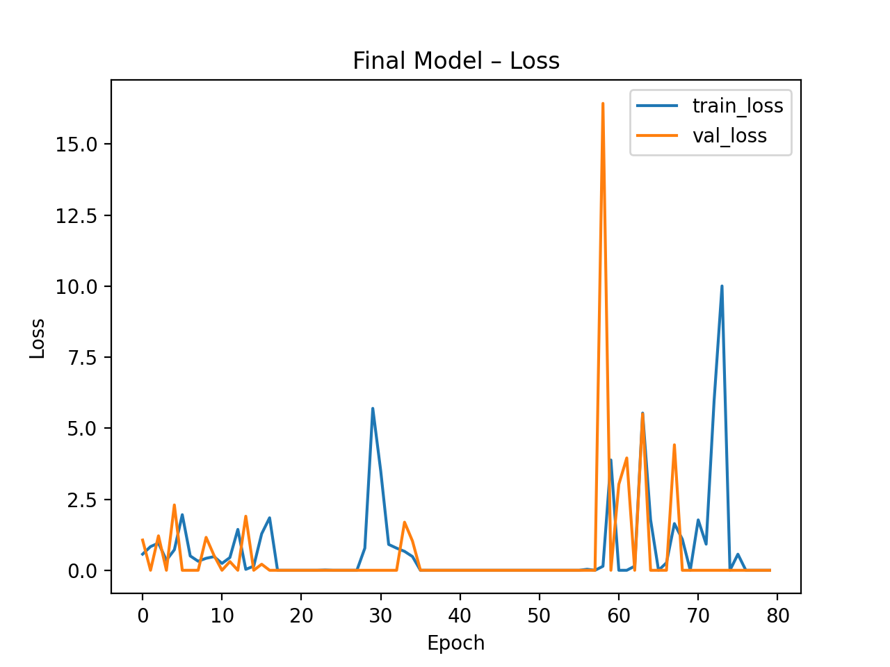
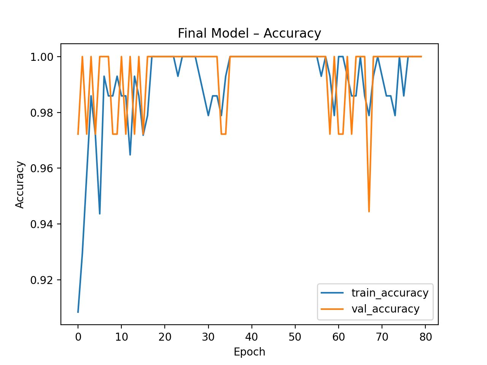

Raport lab4

Podsumowanie tuningu i modelu
1. Parametry testowane

Podczas tuningu przy użyciu Keras Tunera testowano różne kombinacje następujących hiperparametrów:

Liczba warstw ukrytych (num_layers): 1–3

Liczba neuronów w każdej warstwie (units_i): 16, 32, 64

Dropout (dropout_i): włączony/wyłączony, współczynnik 0.1–0.5

Batch Normalization (batchnorm_i): włączony/wyłączony

Współczynnik uczenia (lr): 0.001–0.1

Aktywacja: ReLU dla warstw ukrytych, Softmax dla wyjściowej

2. Metoda tuningu

Wybrano Hyperband (domyślna w Keras Tuner) jako strategię przeszukiwania przestrzeni hiperparametrów, ponieważ pozwala szybko testować wiele kombinacji i efektywnie przydzielać zasoby treningowe. Każda konfiguracja była oceniana na podstawie walidacyjnej dokładności (val_accuracy).

3. Wynik tuningu

Najlepszy zestaw parametrów zapisano w models/best_params.json

Dokładność na zbiorze testowym: 1.0000

Macierz pomyłek (Confusion Matrix):
[[14  0  0]
 [ 0 14  0]
 [ 0  0  8]]

Raport klasyfikacji:

                precision   recall   f1-score   support
     Class 0       1.00      1.00      1.00        14
     Class 1       1.00      1.00      1.00        14
     Class 2       1.00      1.00      1.00         8
    accuracy                           1.00        36
    macro avg      1.00      1.00      1.00        36
    weighted avg   1.00      1.00      1.00        36

### Krzywa uczenia

### Porównanie z lab3

