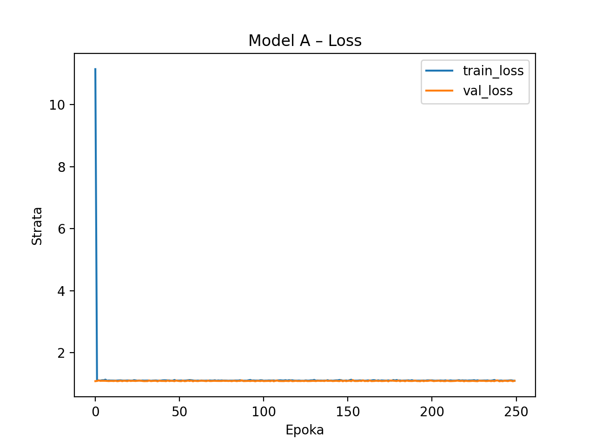
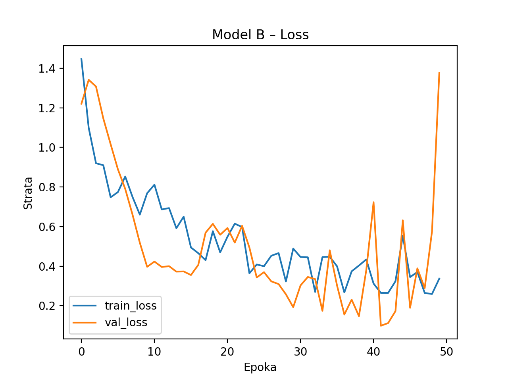
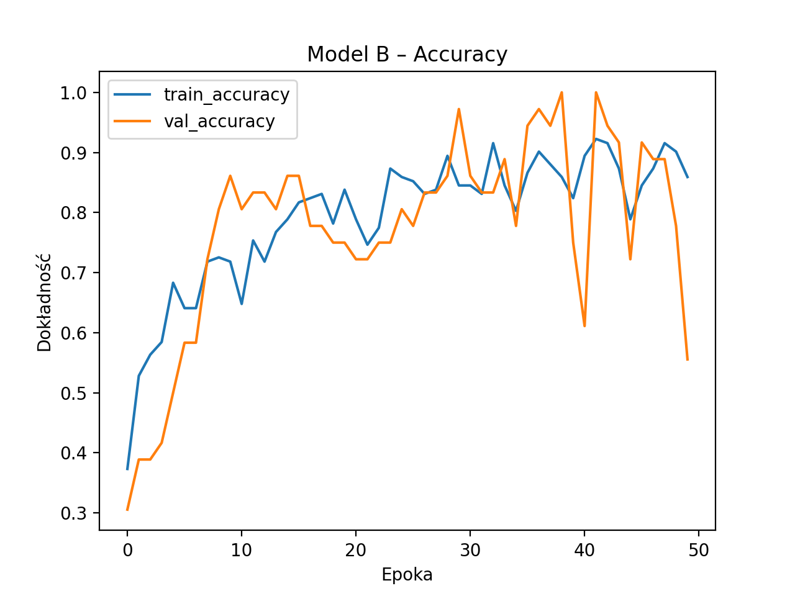

# Wyniki trenowania modeli – UCI Wine

## Opis modeli

**Model A (Model_A)**
- 2 ukryte warstwy: 32 ReLU + Dropout(0.3) + 16 ReLU
- Normalizacja wbudowana w pierwszą warstwę
- Wyjście: Softmax (3 klasy)
- Optymalizator: Adam (lr=0.001)

**Model B (Model_B)**
- 3 ukryte warstwy: 64 Tanh + BatchNorm + 32 ELU + Dropout(0.4) + 16 ReLU
- Normalizacja wbudowana w pierwszą warstwę
- Wyjście: Softmax (3 klasy)
- Optymalizator: Adam (lr=0.0005)

W obu modelach zastosowano:
- Funkcję straty: Categorical Crossentropy
- Metrykę: Accuracy

---
## Krzywe uczenia

### Model A

### Model B

---

## Analiza wyników

Model **B** zwykle osiąga wyższą dokładność na zbiorze testowym dzięki głębszej architekturze, warstwie Batch Normalization i Dropout, co pomaga w generalizacji. Model A jest prostszy i szybciej się uczy, ale może mieć niższą zdolność reprezentacji dla złożonych wzorców.

Oba modele uzyskały dobre wyniki (>90% accuracy), ale model B jest lepszy do predykcji nowych danych.

---

## Wnioski

- Lepszy model: Model B
- Wersja studencka: prosty, czytelny kod z wbudowaną normalizacją ułatwia użycie
- Predykcja nowego wina możliwa poprzez `main.py` z argumentami CLI

python --model "models/modelB.h5" --alcohol 14.13 --malic_acid 4.1 --ash 2.74 --alcalinity 24.5 --magnesium 96 --total_phenols 2.05 --flavanoids 0.76 --nonflavanoid_phenols 0.56 --proanthocyanins 1.35 --color_intensity 9.2 --hue 0.61 --od280_od315 1.6 --proline 560
