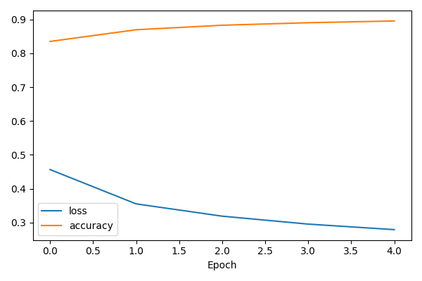
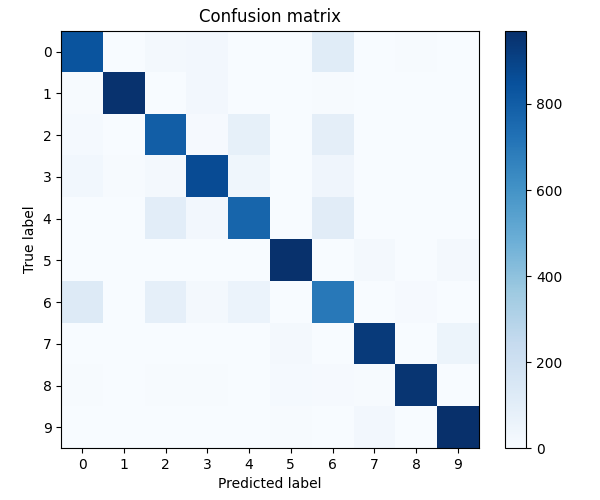
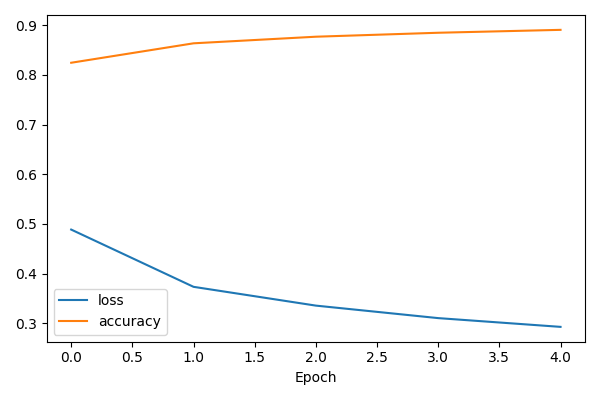
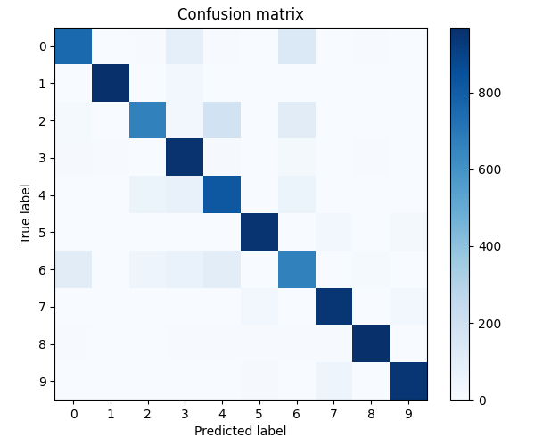
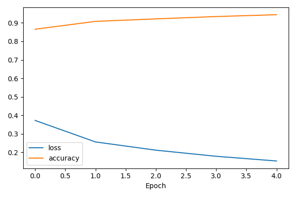
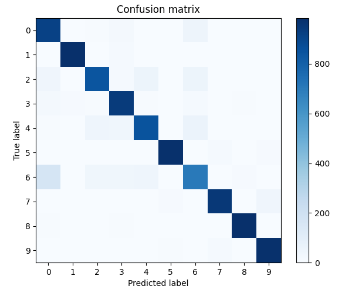
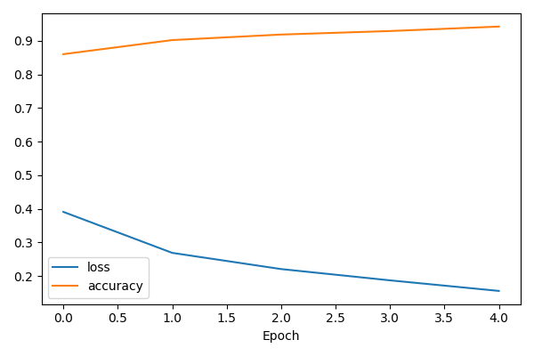
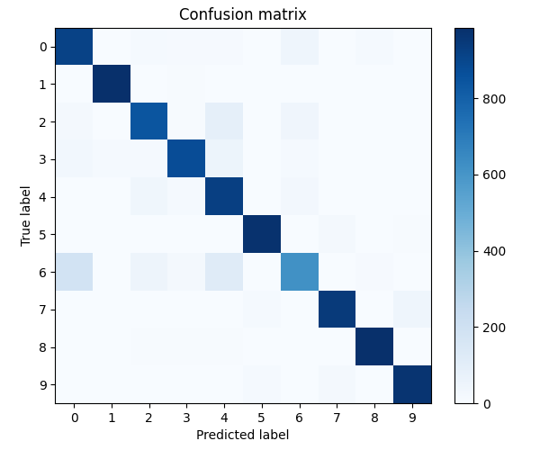

# KNO lab5

Skorzystałem ze zbioru danych Fashion Mnist. <br>
Jest tam 10 klas elementow garderoby w odcieniach szarości (negatywy).

Zbiór danych: https://www.tensorflow.org/datasets/catalog/fashion_mnist <br>
Samouczkek: https://colab.research.google.com/github/mmphego/TensorFlow-Course/blob/master/fashion_mnist.ipynb
 
## Część pierwsza - przygotowanie modelu

Należy zainstalować zależności:
```
pip install -r requirements.txt
```

Aby nauczyć model klasyfikujący ciuchy, korzystając z Keras Tuner:
## Wersja oparta o warstwy w pełni połączone
Zapisuje model do pliku `model_fc.keras`
```
 python train.py --arch fc
```
Strata na zbiorze testowym: 0,353 <br>
Dokładność na zbiorze testowym: 87,43% <br>
Krzywa uczenia:<br>
<br>
Macież pomyłek:<br>


## Wersja oparta o warstwy w pełni połączone wraz z augmentacją<br>
Zapisuje model do pliku `model_fc_augment.keras`
```
python train.py --arch fc --augment
```
Strata na zbiorze testowym: 0.400<br>
Dokładność na zbiorze testowym: 86,28%<br>
Krzywa uczenia:<br>
<br>
Macież pomyłek:<br>

## Wersja oparta o warstwy splotowe<br>
Zapisuje model do pliku `model_cnn.keras`
```
python train.py --arch cnn
```
Strata na zbiorze testowym: 0.255<br>
Dokładność na zbiorze testowym: 91,28%<br>
Krzywa uczenia:<br>
<br>
Macież pomyłek:<br>


## Wersja oparta o warstwy splotowe wraz z augmentacją
Zapisuje model do pliku `model_cnn_augment.keras`
```
python train.py --arch cnn --augment
```
Strata na zbiorze testowym: 0.293<br>
Dokładność na zbiorze testowym: 90,25%<br>
Krzywa uczenia:<br>
<br>
Macież pomyłek:<br>
<br>

# Część druga - wykorzystanie modelu
W folderze `pics` znajduje się 13 zdjęć różnych części garderoby.<br>
Aby wywołać predykcję należy wskazać obrazek oraz model:
```
python predict.py pics/01.png --model models/model_fc.keras
python predict.py pics/01.png --model models/model_fc_augment.keras
python predict.py pics/01.png --model models/model_cnn.keras
python predict.py pics/01.png --model models/model_cnn_augment.keras
```

## Wnioski
Z rozpoznawaniem najlepiej radzi sobie model sieci konwolucyjnej, splotowej (Convolutional Neural Network, CNN) wraz z augmentacją.